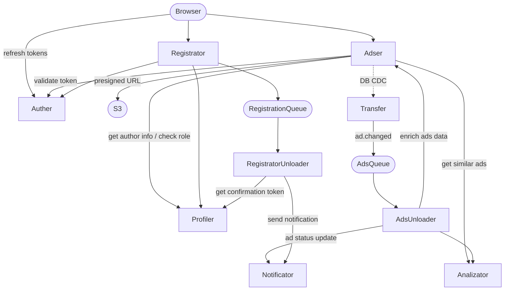

# Архитектура приложения

## Суть проекта

Сервис объявлений с:
- автоматическим обнаружением похожих объявлений
- модерацией (модераторы могут блокировать объявления — перепродажи, нарушения и т.д.)
- уведомлениями (подтверждение регистрации, смена статуса объявления)
- хранением медиафайлов (фото объявлений) в объектном хранилище

---

## Схема взаимодействия сервисов

---

## Сервисы

| Сервис | Технология | Роль |
|--------|------------|------|
| **Frontend** | React + TypeScript | SPA: лента объявлений, поиск/фильтрация, профиль, создание объявлений |
| **Nginx** | Nginx | Reverse proxy, раздача статики frontend |
| **Adser** | FastAPI | Главный сервис: CRUD объявлений, фильтрация, поиск, модерация |
| **Auther** | FastAPI | Auth: выдача/валидация/отзыв access + refresh токенов |
| **Registrator** | FastAPI | Регистрация пользователей, оркестрация создания профиля и аккаунта |
| **Profiler** | FastAPI | Хранение и редактирование профиля пользователя |
| **Analizator** | FastAPI | Индексация объявлений, поиск похожих (по тексту/тегам) |
| **S3** | Object Storage | Хранение медиафайлов (фото объявлений), генерация presigned URL |
| **Transfer** | worker | CDC: читает изменения из БД Adser, публикует события асинхронно |
| **AdsUnloader** | worker | Получает события объявлений, дообогащает данные через Adser, отдаёт в Analizator и Notificator |
| **RegistratorUnloader** | worker | Получает события регистрации, запрашивает токен подтверждения у Profiler, инициирует отправку уведомлений |
| **Notificator** | FastAPI / worker | Отправка email-уведомлений (SMTP / SendGrid) |
| **Kafka** | Apache Kafka | Шина событий: топики `ads` и `registrations` |

---

## Роли пользователей (RBAC)

| Роль | Возможности |
|------|-------------|
| **guest** | просмотр объявлений, поиск, фильтрация |
| **user** | всё выше + создание/редактирование/удаление своих объявлений, загрузка фото |
| **moderator** | всё выше + блокировка/разблокировка любых объявлений, просмотр жалоб |
| **admin** | полный доступ + управление ролями пользователей |

---

## Ключевые потоки данных

### Создание объявления
1. Frontend → Adser: получить presigned URL для фото
2. Frontend → S3: загрузить фото напрямую
3. Frontend → Adser: создать объявление
4. Transfer читает изменение из БД Adser (CDC) → Kafka `ads`
5. AdsUnloader читает Kafka → запрашивает детали у Adser → отдаёт в Analizator

### Поиск похожих объявлений
1. Frontend → Adser: запрос похожих объявлений
2. Adser → Analizator: синхронный запрос по индексу
3. Adser → Frontend: список похожих

### Регистрация
1. Frontend → Registrator: данные формы
2. Registrator → Auther: создать аккаунт
3. Registrator → Profiler: создать профиль
4. Registrator → Kafka `registrations`: событие `user.registered`
5. RegistratorUnloader читает Kafka → запрашивает токен подтверждения у Profiler → Notificator: отправить письмо с подтверждением

### Смена статуса объявления (модерация)
1. Moderator (Frontend) → Adser: заблокировать объявление
2. Adser → Auther: валидировать токен
3. Adser → Profiler: проверить роль пользователя
4. Transfer читает изменение из БД Adser (CDC) → Kafka `ads`
5. AdsUnloader читает Kafka → Notificator: уведомить автора объявления

