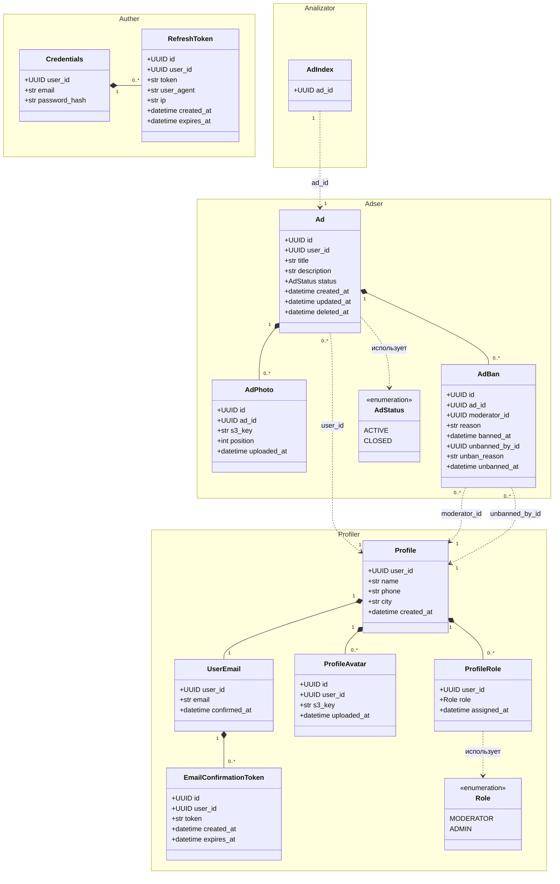

# Диаграммы классов

```mermaid
classDiagram
    namespace Auther {
        class Credentials {
            +UUID user_id
            +str email
            +str password_hash
        }
        class RefreshToken {
            +UUID id
            +UUID user_id
            +str token
            +str user_agent
            +str ip
            +datetime created_at
            +datetime expires_at
        }
    }

    namespace Profiler {
        class Profile {
            +UUID user_id
            +str name
            +str phone
            +str city
            +datetime created_at
        }
        class ProfileRole {
            +UUID user_id
            +Role role
            +datetime assigned_at
        }
        class ProfileAvatar {
            +UUID id
            +UUID user_id
            +str s3_key
            +datetime uploaded_at
        }
        class UserEmail {
            +UUID user_id
            +str email
            +datetime confirmed_at
        }
        class EmailConfirmationToken {
            +UUID id
            +UUID user_id
            +str token
            +datetime created_at
            +datetime expires_at
        }
        class Role {
            <<enumeration>>
            MODERATOR
            ADMIN
        }
    }

    namespace Adser {
        class Ad {
            +UUID id
            +UUID user_id
            +str title
            +str description
            +AdStatus status
            +datetime created_at
            +datetime updated_at
            +datetime deleted_at
        }
        class AdPhoto {
            +UUID id
            +UUID ad_id
            +str s3_key
            +int position
            +datetime uploaded_at
        }
        class AdBan {
            +UUID id
            +UUID ad_id
            +UUID moderator_id
            +str reason
            +datetime banned_at
            +UUID unbanned_by_id
            +str unban_reason
            +datetime unbanned_at
        }
        class AdStatus {
            <<enumeration>>
            ACTIVE
            CLOSED
        }
    }

    namespace Analizator {
        class AdIndex {
            +UUID ad_id
        }
    }

    %% Auther: RefreshToken не существует без Credentials — композиция
    Credentials "1" *-- "0..*" RefreshToken

    %% Profiler: ProfileAvatar, UserEmail, ProfileRole не существуют без Profile — композиция
    Profile "1" *-- "0..*" ProfileAvatar
    Profile "1" *-- "1" UserEmail
    Profile "1" *-- "0..*" ProfileRole
    ProfileRole ..> Role : использует
    %% EmailConfirmationToken не существует без UserEmail — композиция
    UserEmail "1" *-- "0..*" EmailConfirmationToken

    %% Adser: AdPhoto и AdBan не существуют без Ad — композиция
    Ad "1" *-- "0..*" AdPhoto
    Ad "1" *-- "0..*" AdBan
    Ad ..> AdStatus : использует

    %% Кросс-сервисные зависимости (связь по UUID, без прямого FK)
    Ad "0..*" ..> "1" Profile : user_id
    AdBan "0..*" ..> "1" Profile : moderator_id
    AdBan "0..*" ..> "1" Profile : unbanned_by_id
    AdIndex "1" ..> "1" Ad : ad_id
```
