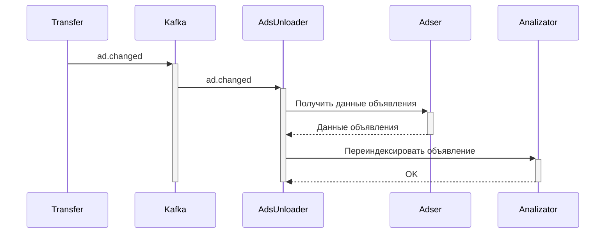

# Асинхронный пайплайн обработки объявлений

Запускается при создании, обновлении или удалении объявления через CDC.

```mermaid
sequenceDiagram
    participant T as Transfer
    participant K as Kafka
    participant U as AdsUnloader
    participant AD as Adser
    participant AN as Analizator

    T->>+K: ad.changed
    K->>+U: ad.changed
    U->>+AD: Получить данные объявления
    AD-->>-U: Данные объявления
    U->>+AN: Переиндексировать объявление
    AN-->>-U: OK
    deactivate U
    deactivate K
```
