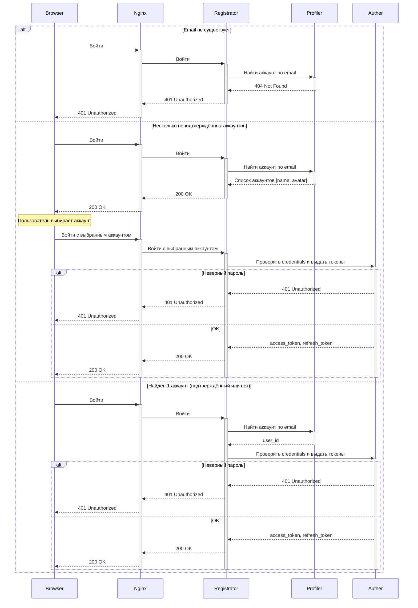
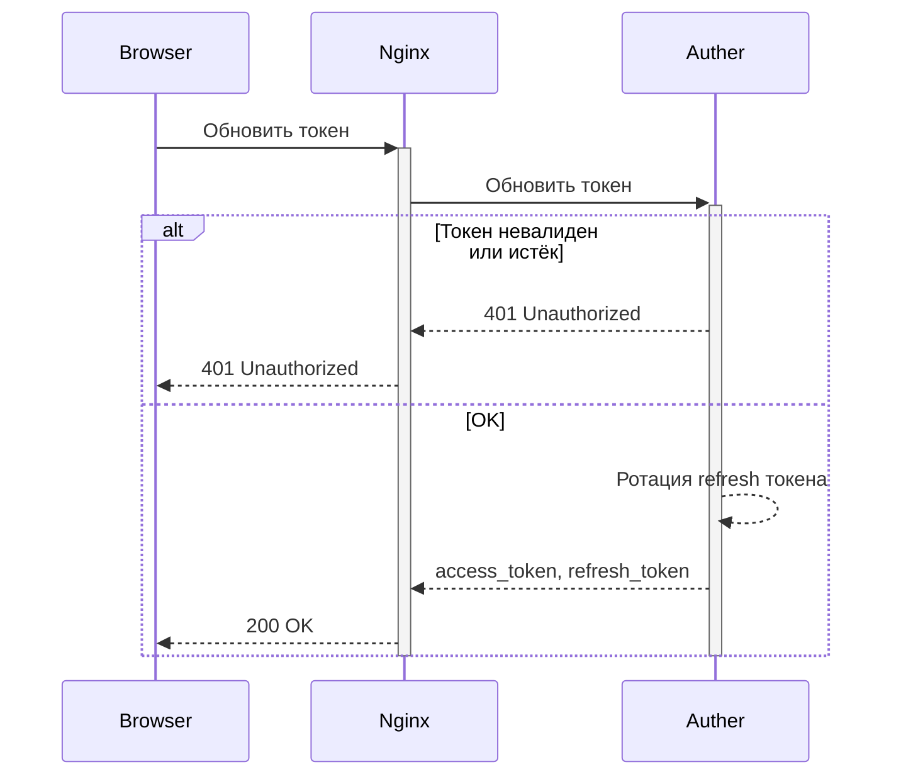
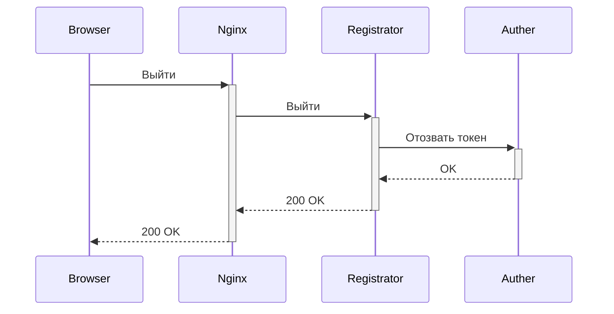

# Вход и выход

## Вход

```mermaid
sequenceDiagram
    participant B as Browser
    participant N as Nginx
    participant R as Registrator
    participant P as Profiler
    participant A as Auther

    alt Email не существует
        B->>+N: Войти
        N->>+R: Войти
        R->>+P: Найти аккаунт по email
        P-->>-R: 404 Not Found
        R-->>-N: 401 Unauthorized
        N-->>-B: 401 Unauthorized
    else Несколько неподтверждённых аккаунтов
        B->>+N: Войти
        N->>+R: Войти
        R->>+P: Найти аккаунт по email
        P-->>-R: Список аккаунтов [name, avatar]
        R-->>-N: 200 OK
        N-->>-B: 200 OK
        Note over B: Пользователь выбирает аккаунт
        B->>+N: Войти с выбранным аккаунтом
        N->>+R: Войти с выбранным аккаунтом
        R->>+A: Проверить credentials и выдать токены
        alt Неверный пароль
            A-->>R: 401 Unauthorized
            R-->>N: 401 Unauthorized
            N-->>B: 401 Unauthorized
        else OK
            A-->>R: access_token, refresh_token
            R-->>N: 200 OK
            N-->>B: 200 OK
        end
        deactivate A
        deactivate R
        deactivate N
    else Найден 1 аккаунт (подтверждённый или нет)
        B->>+N: Войти
        N->>+R: Войти
        R->>+P: Найти аккаунт по email
        P-->>-R: user_id
        R->>+A: Проверить credentials и выдать токены
        alt Неверный пароль
            A-->>R: 401 Unauthorized
            R-->>N: 401 Unauthorized
            N-->>B: 401 Unauthorized
        else OK
            A-->>R: access_token, refresh_token
            R-->>N: 200 OK
            N-->>B: 200 OK
        end
        deactivate A
        deactivate R
        deactivate N
    end
```

## Refresh токена

```mermaid
sequenceDiagram
    participant B as Browser
    participant N as Nginx
    participant A as Auther

    B->>+N: Обновить токен
    N->>+A: Обновить токен
    alt Токен невалиден или истёк
        A-->>N: 401 Unauthorized
        N-->>B: 401 Unauthorized
    else OK
        A-->>A: Ротация refresh токена
        A-->>N: access_token, refresh_token
        N-->>B: 200 OK
    end
    deactivate A
    deactivate N
```

## Выход

```mermaid
sequenceDiagram
    participant B as Browser
    participant N as Nginx
    participant R as Registrator
    participant A as Auther

    B->>+N: Выйти
    N->>+R: Выйти
    R->>+A: Отозвать токен
    A-->>-R: OK
    R-->>-N: 200 OK
    N-->>-B: 200 OK
```
