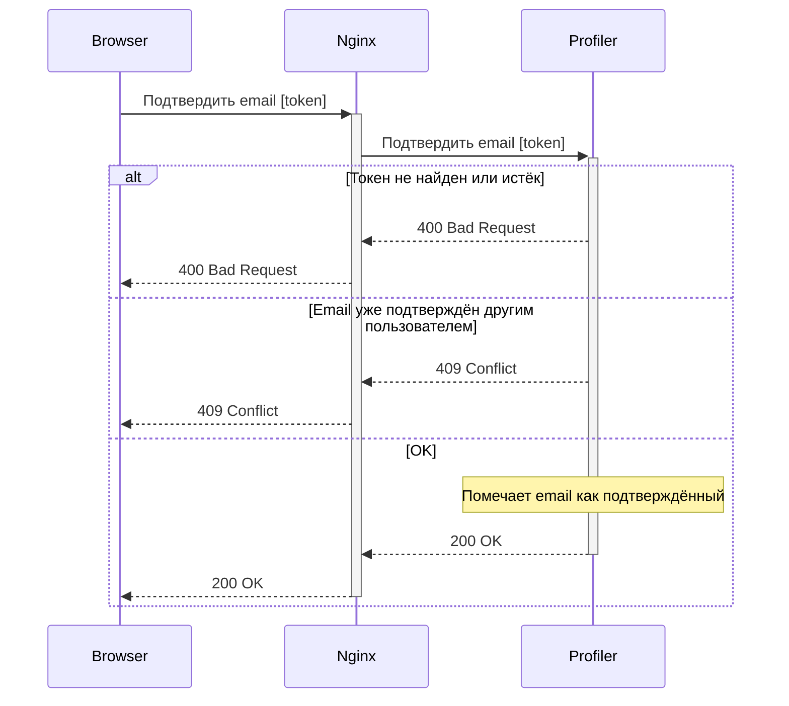

# Подтверждение email

```mermaid
sequenceDiagram
    participant B as Browser
    participant N as Nginx
    participant P as Profiler

    B->>+N: Подтвердить email [token]
    N->>+P: Подтвердить email [token]

    alt Токен не найден или истёк
        P-->>N: 400 Bad Request
        N-->>B: 400 Bad Request
    else Email уже подтверждён другим пользователем
        P-->>N: 409 Conflict
        N-->>B: 409 Conflict
    else OK
        Note over P: Помечает email как подтверждённый
        P-->>-N: 200 OK
        N-->>-B: 200 OK
    end
```
