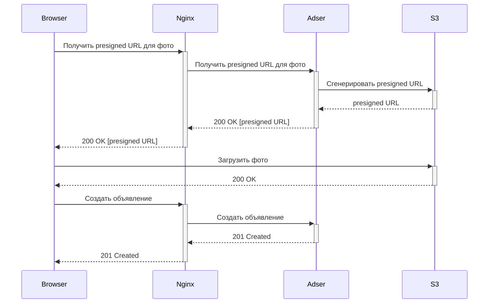

# Создание объявления

```mermaid
sequenceDiagram
    participant B as Browser
    participant N as Nginx
    participant AD as Adser
    participant S3

    B->>+N: Получить presigned URL для фото
    N->>+AD: Получить presigned URL для фото
    AD->>+S3: Сгенерировать presigned URL
    S3-->>-AD: presigned URL
    AD-->>-N: 200 OK [presigned URL]
    N-->>-B: 200 OK [presigned URL]

    B->>+S3: Загрузить фото
    S3-->>-B: 200 OK

    B->>+N: Создать объявление
    N->>+AD: Создать объявление
    AD-->>-N: 201 Created
    N-->>-B: 201 Created
```
