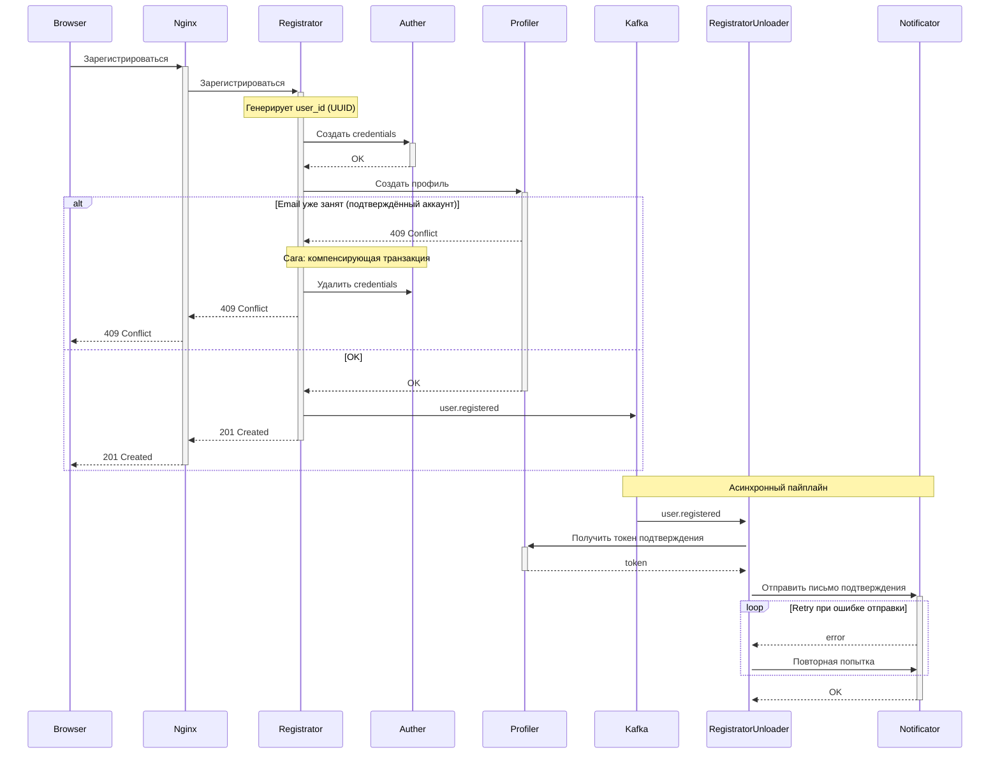

# Регистрация пользователя

```mermaid
sequenceDiagram
    participant B as Browser
    participant N as Nginx
    participant R as Registrator
    participant A as Auther
    participant P as Profiler
    participant K as Kafka
    participant U as RegistratorUnloader
    participant NT as Notificator

    B->>+N: Зарегистрироваться
    N->>+R: Зарегистрироваться

    Note over R: Генерирует user_id (UUID)

    R->>+A: Создать credentials
    A-->>-R: OK

    R->>+P: Создать профиль

    alt Email уже занят (подтверждённый аккаунт)
        P-->>R: 409 Conflict
        Note over R,A: Сага: компенсирующая транзакция
        R->>A: Удалить credentials
        R-->>N: 409 Conflict
        N-->>B: 409 Conflict
    else OK
        P-->>-R: OK
        R->>K: user.registered
        R-->>-N: 201 Created
        N-->>-B: 201 Created
    end

    Note over K,NT: Асинхронный пайплайн
    K->>+U: user.registered
    U->>+P: Получить токен подтверждения
    P-->>-U: token
    U->>+NT: Отправить письмо подтверждения
    loop Retry при ошибке отправки
        NT-->>U: error
        U->>NT: Повторная попытка
    end
    NT-->>-U: OK
```
